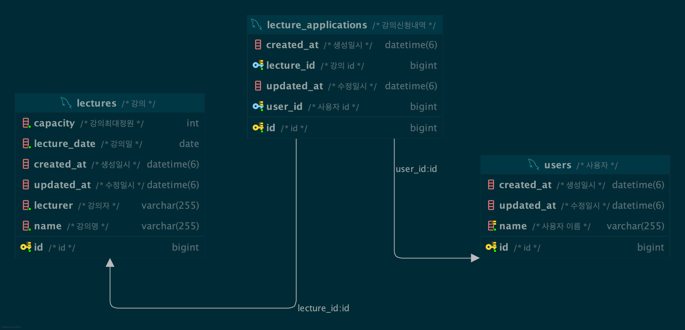

# lecture-apply-service

this is lecture-apply-service

## environment

1. springboot3.3.5
2. kotlin
3. java 17
4. [kotest][kotest] & [mockk][mockk]
5. [ktlint12][ktlint]

## project setup

1. git hooks setting  
   git hooks를 세팅합니다.
    ```shell
    ./gradlew installLocalGitHook # commit-msge
    ./gradlew addKtlintCheckGitPreCommitHook # pre-commit
    ```
2. create config files  
   프로젝트에 필요한 환경변수 및 설정 파일을 세팅합니다.
    ```shell
    cp .env-sample .env
    cp src/main/resources/application-sample.yml src/main/resources/application.yml
    ```

## 요구사항

1. **특강 신청 API**
    - 특정 userId 로 선착순으로 제공되는 특강을 신청하는 API 를 작성합니다.
    - 동일한 신청자는 동일한 강의에 대해서 한 번의 수강 신청만 성공할 수 있습니다.
    - 특강은 선착순 30명만 신청 가능합니다.
    - 이미 신청자가 30명이 초과 되면 이후 신청자는 요청을 실패합니다.
2. **특강 선택 API**
    - 날짜별로 현재 신청 가능한 특강 목록을 조회하는 API 를 작성합니다.
    - 특강의 정원은 30명으로 고정이며, 사용자는 각 특강에 신청하기 전 목록을 조회해 볼 수 있어야 합니다.
3. **특강 신청 완료 목록 조회 API**
    - 특정 userId 로 신청 완료된 특강 목록을 조회하는 API 를 작성합니다.
    - 각 항목은 특강 ID 및 이름, 강연자 정보를 담고 있어야 합니다.
4. **etc**
    - 다수의 인스턴스로 어플리케이션이 동작하더라도 기능에 문제가 없도록 작성하도록 합니다.
    - 동시성 이슈를 고려 하여 구현합니다.

### erd
요구사항을 최대한 간단하게 구현하고자 하였습니다.

동일한 강의는 하루에 한개만 있다는 가정하에 lecture_date(강의날짜), capacity(강의 수용 최대 정원)등을 설정하였습니다.

잔여 좌석의 경우는 `capacity - 강의 신청한 사용자 수`를 활용하여 application에서만 가지고 있습니다. 

그리고 강의 신청 내역 테이블은 user의 강의 신청 내역이 담겨있습니다.

사용자 테이블은 이름이 담겨있습니다.

### 동시성 제어
동시성 제어를 위해 mysql의 락 획득/해제를 활용하였습니다. 명시적으로 락을 획득하고자 이 방식을 선택하여 진행하였습니다.

- sql
```sql
SELECT GET_LOCK(:key, 3000);
SELECT RELEASE_LOCK(:key);
```

- code
```kotlin
fun applyForLecture(
        lectureId: Long,
        user: User,
    ): Boolean {
        val lockAcquired = lectureRepository.getLock("lecture_$lectureId") == 1

        if (lockAcquired) {
            try {
                val lecture = lectureRepository.getLectureById(lectureId)
                if (!lecture.hasCapacity()) {
                    return false
                }
                if (lecture.hasUserApplied(user)) {
                    return false
                }

                val lectureApplication =
                    LectureApplication(
                        lecture = lecture,
                        participant = user,
                    )
                lectureApplicationRepository.save(lectureApplication)
                return true
            } catch (e: Exception) {
                return false
            } finally {
                lectureRepository.releaseLock("lecture_$lectureId")
            }
        }

        return false
    }
```



### **`STEP 3`**
- 서비스 수준의 동시성 테스트 : `LectureApplicationServiceConcurrencyTest`
- 통합테스트 : `LectureFacadeTest`

### **`STEP 4`**
- 같은 사용자가 동일한 특강에 대해 신청 성공하지 못하도록 개선  
    `lecture` 도메인에 특강을 신청했는지에 대한 여부를 확인 후 이미 해당 사용자가 신청한 특강이라면 exception을 발생하게하여 중복 신청 방지  
    unique constraint를 사용한다면 db의존성이 생길 수 있기에 어플리케이션에서 해결.  
```kotlin
    fun hasUserApplied(user: User): Boolean {
    lectureApplications.firstOrNull { it.participant.id == user.id }
        ?: return false
    throw LectureAlreadyAppliedException(user.id, id)
} 
```

- 서비스 수준의 동시성 테스트 : `LectureApplicationServiceConcurrencyTest`
- 통합테스트 : `LectureFacadeTest`
 

- 동일한 유저 정보로 같은 특강을 5번 신청했을 때, 1번만 성공하는 것을 검증하는 **통합 테스트** 작성

[ktlint]: https://github.com/JLLeitschuh/ktlint-gradle?tab=readme-ov-file#configuration

[kotest]: https://kotest.io/docs/quickstart

[mockk]: https://mockk.io/
